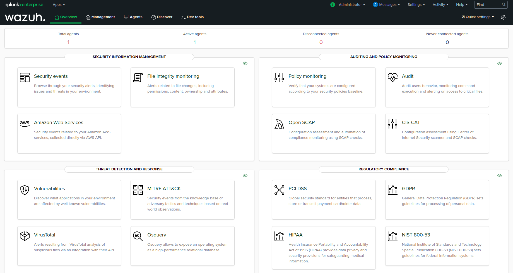

# Splunk App for Fortishield

[](https://fortishield.com/community/join-us-on-slack/)
[](https://groups.google.com/forum/#!forum/fortishield)
[](https://documentation.fortishield.com)
[](https://fortishield.com)

 The Fortishield App for Splunk offers an option to visualize _Fortishield Alerts_ and _API data_. Fortishield helps you to gain deeper security visibility into your infrastructure by monitoring hosts at an operating system and application level.
* * *

### Documentation

- [Fortishield App for Splunk installation guide](https://documentation.fortishield.com/current/deployment-options/splunk/index.html)

## Branches

- `stable` branch on correspond to the last Fortishield App stable version.
- `master` branch contains the latest code, be aware of possible bugs on this branch.

## Installation and Upgrade

### Requirements
1. A Fortishield Manager with a running and accesible API.
2. A __Splunk Universal Forwarder__ installed along with the Fortishield Manager.
3. At least one __Splunk Enterprise Indexer__.

### Using the Web User Interface (WUI)

1. Download the App package that matches your installation (Fortishield and Splunk version, check the [Compatibilty Matrix](#compatibility-matrix)).
2. Go to the Splunk WUI main page and click on the **gear** icon (Manage Apps), at the sidebar.
3. Click on the `Install App from file` button.
4. Select and upload the downloaded App package.
5. Check the `Upgrade App` checkbox if a Fortishield App is already installed.
6. Click on `Upload`. A restart of the Indexer may be required.

### Using the Command Line Interface (CLI)

1. Download the App package that matches your installation (Fortishield and Splunk version, check the [Compatibilty Matrix](#compatibility-matrix)).
2. If an older App is already installed, remove it using the Splunk binary:
    
    ```bash
    $SPLUNK_HOME/bin/splunk remove app SplunkAppForFortishield
    ```
3. Install the App:

    ```bash
    $SPLUNK_HOME/bin/splunk install app <downloaded_package>
    ```

### Compatibility Matrix

The compatibility matrix is avaliable in the repository [wiki](https://github.com/fortishield/fortishield-splunk/wiki/Compatibility).

## Contribute

If you want to contribute to our project please don't hesitate to send a pull request. You can also join our users [mailing list](https://groups.google.com/d/forum/fortishield), by sending an email to <mailto:fortishield+subscribe@googlegroups.com>, to ask questions and participate in discussions.

## Copyright & License

Copyright (C) 2015-2022 Fortishield, Inc.

This program is free software; you can redistribute it and/or modify it under the terms of the GNU General Public License as published by the Free Software Foundation; either version 2 of the License, or (at your option) any later version.

Find more information about this on the [LICENSE](LICENSE) file.

## References

-   [Fortishield website](https://fortishield.com)
-   [Fortishield documentation](https://documentation.fortishield.com)
-   [Splunk documentation](http://docs.splunk.com/Documentation)
